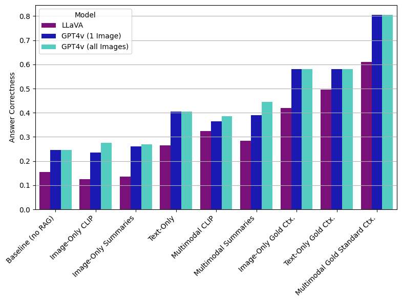

# Beyond Text: Optimizing RAG with Multimodal Inputs for Industrial Applications

This repository implements the methods described in the paper [Beyond Text: Optimizing RAG with Multimodal Inputs for Industrial Applications](https://arxiv.org/abs/2410.21943). It provides the tools, scripts, and evaluation methods necessary to reproduce the experiments presented in the paper.

## Table of Contents

- [Introduction](#introduction)
- [Features](#features)
- [Pipeline Overview](#pipeline-overview)
- [Installation](#installation)
- [Usage](#usage)
- [Directory Structure](#directory-structure)
- [License](#license)

## Introduction

Large Language Models (LLMs) have demonstrated impressive capabilities in various natural language processing tasks. However, they often face challenges like domain-specific knowledge limitations and hallucinations. **Retrieval-Augmented Generation (RAG)** is an effective solution to address these limitations by combining document retrieval with generative language models.

**Multimodal RAG** extends RAG capabilities by integrating text and image data, crucial for applications in the industrial domain. This repository explores various RAG configurations using both **text-only**, **image-only**, and **multimodal** inputs, with a focus on optimizing retrieval and generation for domain-specific tasks.

## Features

- **Text-only RAG**: Uses text-based retrieval and generation to provide answers based on text data only.
- **Image-only RAG**: Focuses on retrieving images relevant to the query and generating responses based solely on visual data.
- **Multimodal RAG**: Combines text and image modalities, allowing the model to generate responses using both textual and visual information.
- **Evaluation with LLM as a Judge**: Uses an LLM-based evaluation framework to assess generated responses across multiple metrics such as:
  - **Answer Correctness**
  - **Answer Relevancy**
  - **Text Context Relevancy**
  - **Image Context Relevancy**
  - **Text Faithfulness**
  - **Image Faithfulness**

Answer generation and evaluation are performed using two LLMs: **GPT-4V** and **LLaVA**.


## Pipeline Overview

The **Multimodal RAG** architecture consists of two primary configurations for processing text and image data: 

1. **Multimodal Embeddings and Separate Vector Stores**: In this configuration, images are embedded using CLIP, while text is embedded using a different model, such as `text-embedding-3-small`. The embeddings are stored in separate vector stores. During retrieval, the user query is embedded for both modalities, and separate similarity searches are conducted in each store, ensuring that relevant results for both text and image are retrieved independently.

   

2. **Image Summaries and Combined Vector Store**: In this configuration, images are converted into text summaries using a multimodal LLM. These summaries are then embedded, along with the text chunks extracted from the documents, using the same embedding model (`text-embedding-3-small`). All the embeddings are stored in a single combined vector store, allowing for a unified similarity search that retrieves both text and image information.

   


## Installation

To install the required dependencies, use the following command:

```sh
pip install -r requirements.txt
```

### Configuration Note

Before running the experiments, make sure to configure the following:

- **OpenAI Endpoint**: Specify your `openai_endpoint` in the `azure_config.py` file.
- **Environment Variables**: Set the following environment variables if you are using OpenAI LLMs and embedding models:
  - `AZURE_OPENAI_API_KEY`: Required for accessing OpenAI LLMs.
  - `AZURE_OPENAI_API_KEY_EMBEDDING`: Required for accessing OpenAI embedding models.


## Usage

To use the system, follow these steps:

1. **Define Models and Paths**:  
   Have a look at the `rag_env.py` file and define your desired models and paths.

2. **Extract Texts and Images**:  
   Extract texts and images from your defined folder containing PDF files using the following script:
   ```sh
   python src/data_extraction/pdf_context_extractor.py
   ```
   
3. **Summarize Extracted Images**:
Run the context_summarization.py to summarize the extracted images into textual summaries. This is required for running the image-only and multimodal RAG pipelines that leverage image summaries instead of multimodal embeddings. Summarizing the texts extracted from the PDFs is optional.
   ```sh
   python src/data_summarization/context_summarization.py
   ```
   
4. **Run the Desired RAG Experiment**:  
   Navigate to the `question_answering` folder and choose the appropriate script from the folder corresponding to your desired approach:
   - **baseline**: Directly prompts the model with the question without RAG.
   - **correct_context_prompting**: Provides the correct context along with the question to show the upper performance bound simulating a setting with perfect retrieval.
   - **rag**: Contains run files for **text-only**, **image-only**, and **multimodal** RAG experiments.

   Example command to run the **multimodal RAG** experiment:
   ```sh
   python src/question_answering/rag/run_multimodal_rag.py
   ```

5. **Evaluate Your Results**:  
   Evaluate the results of your experiments using:
   ```sh
   python src/evaluation/evaluate_rag_pipeline.py
   ```
   
You are done!


## Directory Structure

- `img`: Contains images used for documentation and result visualization.
- `sample_data`: Sample data used for testing and evaluating the system. Refer to the [data_readme.md](sample_data/data_readme.md) in the `sample_data` folder for more information.
- `src`: Source code for the various components:
  - `data_extraction`: Tools and scripts for extracting relevant text and image data from raw PDF files.
  - `data_summarization`: Contains tools for summarizing text and image data.
  - `question_answering`:
    - `rag`: Implements different RAG versions (text-only, image-only, multimodal).
    - `baseline`: Contains baseline methods for comparison with the RAG approaches.
    - `correct_context_prompting`: Implements methods for prompting model with the gold standard context instead of performing RAG as an upper performance bound.
  - `evaluation`: Implements evaluation scripts to judge RAG performance using LLMs.

## Results

The following figure provides an overview of the **Answer Correctness** of different RAG approaches, including text-only, image-only, and multimodal RAG. This visualization shows how integrating multiple modalities affects the accuracy of generated responses.



More results can be found in the `img/results` folder.

## How to Cite

If you use this code or find our work helpful, please cite our paper:

```bibtex
@misc{riedler2024textoptimizingragmultimodal,
      title={Beyond Text: Optimizing RAG with Multimodal Inputs for Industrial Applications}, 
      author={Monica Riedler and Stefan Langer},
      year={2024},
      eprint={2410.21943},
      archivePrefix={arXiv},
      primaryClass={cs.CL},
      url={https://arxiv.org/abs/2410.21943}, 
}
```

## License

This project is licensed under the MIT License - see the [LICENSE](LICENSE) file for details.
